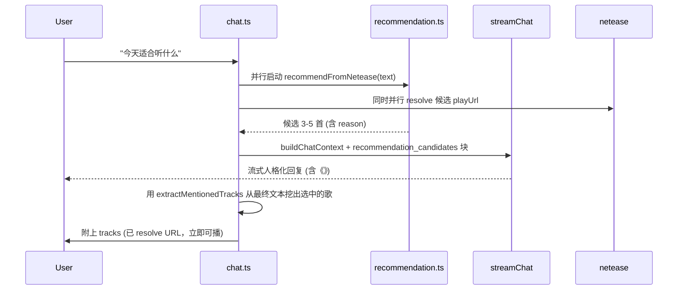

# Echo v0.1 修复计划

## 总体节奏

```mermaid
flowchart LR
    PhaseA[A. Release 硬伤<br/>4 项] --> PhaseB[B. 体验补缺<br/>4 项] --> PhaseC[C. 产品打磨<br/>5 项]
    PhaseA -. 完成即可发 v0.1.1 .-> Mark1[里程碑 1]
    PhaseB -. 完成即可发 v0.1.2 .-> Mark2[里程碑 2]
    PhaseC -. 完成即可发 v0.1.3 .-> Mark3[里程碑 3]
```

每个阶段做完先自验、再让你试，过了再进下一阶段。

---

## Phase A — Release 硬伤（必须修）

### A-1. `prompts/` / `samples/` 打进安装包

`package.json` 当前 `build.files` 只有 `dist`、`dist-electron`、`node_modules`，仓库根的 `prompts/`、`samples/`、`design/` 没进 nsis 包，打包后 `readRootFile()` 全部返回空字符串，Echo 会"失忆"。

- [echo-app/package.json](echo-app/package.json) 加 `build.extraResources`：
  - 把仓库根的 `prompts`、`samples` 拷到 `resources/`（`design/` 仅 dev 时浏览器看，不打包）
- [echo-app/src/main/utils/paths.ts](echo-app/src/main/utils/paths.ts) `findRepoRoot()` 在候选列表头部加 `process.resourcesPath`，并把判定文件改成 `prompts/system.md`（已经是了，保留）
- 打一次 `npm run dist` 自验：装出来的 nsis 应用聊天能正常出回复、音忆能写、carePing 文案不空

### A-2. `safeStorage` 假加密降级

[echo-app/src/main/netease/auth.ts](echo-app/src/main/netease/auth.ts) 和 [echo-app/src/main/db/settings.ts](echo-app/src/main/db/settings.ts) 当前 `safeStorage` 不可用时退到 `plain:base64`，等于 API key 和网易云 cookie 明文存。

- 把降级路径砍掉：`safeStorage.isEncryptionAvailable() === false` 时直接抛错，并在 [echo-app/src/main/services/health.ts](echo-app/src/main/services/health.ts) 写一条 `service_health` 警告
- [echo-app/src/renderer/pages/Settings.tsx](echo-app/src/renderer/pages/Settings.tsx) 服务状态卡片新增"加密存储不可用"红色提示
- 加密不可用时设置页 API key 输入框 disable，避免用户误以为存进去了
- 兼容已有用户：检测到 `plain:` 前缀的旧值时一次性读出来再用 safeStorage 重写一次（如 safeStorage 可用），否则清空并提示重填

### A-3. 聊天推荐分流（关键，走 llm_wrap）

当前 [echo-app/src/main/services/chat.ts](echo-app/src/main/services/chat.ts) 的 `looksLikeRecommendationRequest()` 一旦命中就完全跳过 LLM，用 `recommendationContent()` 模板拼出"这个晚上我先给你放《xxx》"，Echo 在最常见场景里"不像它自己"。

新流程：



具体落点：
- `chat.ts` 删掉 `recommendationContent()` 早返回分支；保留 `looksLikeRecommendationRequest()` 但只用作"是否提前抓候选"的预测器
- `buildChatContext()` 在 [echo-app/src/main/llm/prompt.ts](echo-app/src/main/llm/prompt.ts) 增加可选的 `recommendationCandidates` 参数，注入 `<recommendation_candidates>` 块
- [prompts/system.md](prompts/system.md) 增补一段"如果 context 给了 `recommendation_candidates`，你只能从里面选 1-3 首，写在《》里，并用 Echo 的语气解释为什么这一刻是它"
- LLM 流回完之后再调 `resolveMentionedTracks()`，但优化为"提前并行 resolve"以减少阻塞
- 失败回退：LLM 失败 → 退回当前的模板文案（保留兜底）

### A-4. 错过的关怀提醒补发 / 合并

[echo-app/src/main/services/scheduler.ts](echo-app/src/main/services/scheduler.ts) `rescheduleCarePings()` 当前对错过的窗口直接 `updateCarePingPlanStatus(record.id, 'skipped', ...)`，对一个"陪伴"产品不合适。

- `runStartupCatchup()` 增加 carePings 段：开机时统计今天 `status === 'skipped'` 且未发的 plan
- 如果距上次发送提醒 ≥ 30 分钟且当前在某个窗口的"宽限期"内（窗口结束后 2 小时内）：发一条合并通知"我今天本来想找你 N 次，刚醒过来发现都错过了"
- 如果错过的全是过去几小时的：合并成一条单一通知，避免连环弹窗
- 通知点击逻辑复用现有 `handleNotificationClick`

---

## Phase B — 体验补缺

### B-5. 未登录网易云时给清晰引导

[echo-app/src/main/services/recommendation.ts](echo-app/src/main/services/recommendation.ts) `fetchCandidates()` 第一行 `if (!cookie) return []`，用户对话里得到的是"这次没有拿到可播放的合适候选"，根本不知道是没登录。

- `recommendFromNetease()` 在 cookie 为空时返回特殊标记（如 throw `NeteaseAuthRequiredError`）
- [echo-app/src/main/services/chat.ts](echo-app/src/main/services/chat.ts) 接住后让 LLM 在 system prompt 里看到这个状态，说类似"我现在还没拿到你的网易云权限——去设置页扫个码我就能开始挑歌"，并在前端把这条消息附带一个"去登录"按钮

### B-6. Player 拖拽 seek 时的抖动

[echo-app/src/renderer/components/Player.tsx](echo-app/src/renderer/components/Player.tsx) 心跳节流（5 秒）和 `state.position` 修正 effect 在快速拖拽时会互相打架。

- seek 后用 `lastUserSeekAt` 时间戳，屏蔽 1 秒内来自主进程的 `state-changed` 反向修正
- 拖拽过程中（`draggingSeekRef === true`）暂停心跳，松手后立即一次 force heartbeat

### B-7. `getMostRecentSeal` 文件遍历缓存

[echo-app/src/main/services/daySeal.ts](echo-app/src/main/services/daySeal.ts) `getMostRecentSeal()` 每次发消息/生成 listening segment/写 carePing 都 `readdirSync` + `readFileSync`。

- 加模块级缓存：`{ date, content, mtime }`，每次调用先检查 seals 目录里今天最新文件的 mtime，未变就直接返回缓存

### B-8. Tab 切换闪屏

[echo-app/src/App.tsx](echo-app/src/App.tsx) 用 `page === 'chat' && <ChatPage>` 条件渲染，每次切回 Chat 都会触发 `loadRecent(30)`。

- 改用"全部挂载 + display 切换"：在 `App.tsx` 里把所有页面包一层 `<div style={{display: page === key ? 'block' : 'none'}}>`，组件不卸载
- 或者把 `messages`、`favoriteKeys`、`history` 这些 state lift 到 App 顶层

我倾向第一种，改动小、副作用少。

---

## Phase C — 产品打磨

### C-9. 大歌单导入进度反馈

[echo-app/src/main/services/semantics.ts](echo-app/src/main/services/semantics.ts) `buildSemanticsForTracks()` 一次 25 首批量调 LLM，500 首 → 20 次调用，前端只看到一句"正在生成画像..."。

- 主进程新加 broadcast 频道 `import:progress`，每个 batch 开始/结束时发 `{ phase, current, total }`
- preload 暴露 `echo.import.onProgress(listener)`
- [echo-app/src/renderer/pages/Settings.tsx](echo-app/src/renderer/pages/Settings.tsx) 导入按钮区显示进度条 `语义标注 12/20 批 · 已用 18s`

### C-10. `detectFullscreen` 真正生效

[echo-app/src/renderer/pages/Settings.tsx](echo-app/src/renderer/pages/Settings.tsx) 当前开关注释写着"v0.5.1 完善"，实际不生效。

- 在 [echo-app/src/main/services/carePings.ts](echo-app/src/main/services/carePings.ts) `runCarePingSlot()` 调用前增加全屏检测：
  - Windows：用 `screen.getPrimaryDisplay()` + 比较前台窗口尺寸 / `BrowserWindow.getFocusedWindow()` 旁路法（轻量）
  - 检测到全屏时返回 `{ status: 'skipped', message: '检测到全屏（可能在打游戏 / 看片）' }`
- 简单起见，第一版只做 Windows，跨平台等到 v0.6

### C-11. TTS 服务可配置

[echo-app/src/renderer/pages/Settings.tsx](echo-app/src/renderer/pages/Settings.tsx) `tts.baseUrl` 当前 `readOnly`，跟 LLM 可任意切换的灵活性不一致。

- 解锁 `tts.baseUrl` 输入框，加"测试 TTS"按钮调用一次短语合成
- [echo-app/src/main/tts/client.ts](echo-app/src/main/tts/client.ts) 增加超时和健康记录
- 提供两个 preset：`https://tts.wangwangit.com`（默认）、自定义

### C-12. 关闭时优雅退出超时

[echo-app/electron/main.ts](echo-app/electron/main.ts) `before-quit` 里 `await archiveDaySeal()`，LLM 慢响应时退不掉。

- `archiveDaySeal()` 内部加 `Promise.race([generateSeal(...), wait(5000)])`
- 超时直接走 `fallbackSeal`，保证关闭流畅

### C-13. 音忆未读小红点

每天 22:00 自动生成的音忆用户经常错过。

- [echo-app/src/main/db/settings.ts](echo-app/src/main/db/settings.ts) 新增 `meta.lastViewedYinyiAt` 字段
- [echo-app/src/renderer/pages/Yinyi.tsx](echo-app/src/renderer/pages/Yinyi.tsx) 进入页面时调一次 `settings.update('meta.lastViewedYinyiAt', latestDate)`
- [echo-app/src/App.tsx](echo-app/src/App.tsx) tab 上根据 `latestYinyiDate > lastViewedYinyiAt` 显示一个小圆点

---

## 不做的事（明确划线）

- **不动数据库 schema 的列定义**，只在已有表上加 setting key 或新增独立表（如未读状态走 `meta` 字段而非新表）
- **不动 prompt 的核心人格描述**，只在 `system.md` 末尾增补 `recommendation_candidates` 协议段
- **不引入新的依赖**（除非必要的全屏检测库），优先用 Electron 原生 API
- **不改 v0.1 视觉**，所有改动都尽量在现有 CSS class 体系内做

---

## 验收清单（每阶段做完前必跑一次）

每个阶段我会列一个具体可手动验证的清单，比如 Phase A：

- [ ] `npm run dist` 出 nsis 包，装到一台干净的 Windows 上，跑完整次"导入歌单 → 聊一次 → 写音忆"流程不出空文案
- [ ] 临时 mock `safeStorage.isEncryptionAvailable() === false`，验证 API key 写入被拒绝且 UI 红色提示出现
- [ ] 对话发"今天适合听什么"，得到的回复必须含 Echo 语气（"我猜"/"我先"/"你这会儿"），且歌曲卡片正常嵌入并可播
- [ ] 把 App 关掉一天，第二天上午 11 点开机，应当收到一条合并的"我今天本来想找你"通知（而不是静默）