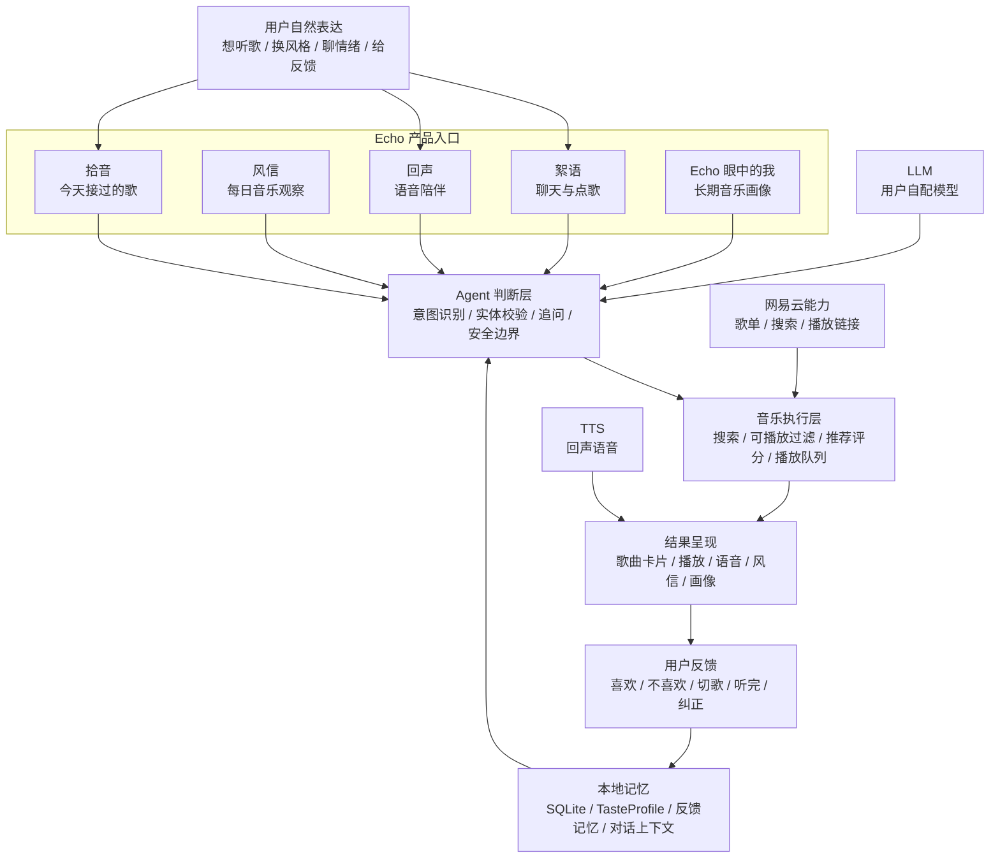

# 我做了一个住在电脑里的 AI 音乐伴侣：Echo

有些软件一打开，就知道它要你做什么。

搜索、点击、播放、切歌、收藏。

我一直想做一个更像“音乐朋友”的东西：你可以跟它聊天，说“今天有点累”“来点安静的”“这首不太对，换一首更有劲的”，它能听懂你当下的意思，真的去找一首能播放的歌，并且慢慢记住你喜欢什么、讨厌什么、什么时候需要什么。

这个软件叫 **Echo**。

它目前是一个 Windows 桌面应用。它的核心定位很明确：**本地优先、免费使用、由你自己配置模型和音乐账号的 AI 音乐伴侣**。

## Echo 解决的是“我现在该听什么”

传统音乐软件已经很强了。网易云、QQ 音乐、Apple Music 都能搜索、播放、收藏、推荐歌单。

Echo 的切入点更窄，也更私人：**当你不知道该听什么时，它能根据你的表达、当前播放、历史反馈和长期口味，帮你把音乐接上。**

比如你说：

> 有点困，来点不吵的。

Echo 应该知道这句话对应一个音乐动作：找一首不刺耳、节奏别太冲、适合当前状态的歌。

你说：

> 这首歌不好听，换一首激情一点的。

Echo 应该识别出两层含义：你刚刚否定了当前方向，同时给了一个新的音乐要求：更高能、更有冲击力。

你说：

> 类似《大鱼海棠》那首歌的感觉，推荐下。

Echo 应该先理解你大概想要的是相似氛围，再结合实体校验和追问机制处理歌名、歌手、版本这些不确定信息。

这就是 Echo 的核心：**它先理解你的话，再执行音乐动作。**

## 一张图看懂 Echo

Echo 的产品结构可以用一张图表达：上层是用户能感受到的五个入口，中间是 agent 的判断和执行，下层是本地记忆与外部能力。

这张图里有三个重点。

第一，Echo 的入口看起来是五个页面，底层跑的是同一套理解和记忆系统。你在絮语里说“不喜欢这首”，会影响后面的推荐，也会影响 Echo 眼中的长期画像。

第二，Echo 的音乐动作会落到真实播放。它会通过网易云能力搜索候选、过滤可播放歌曲，再把结果变成对话里的歌曲卡片、回声里的背景音乐、拾音里的当天记录。

第三，Echo 的记忆留在本地。对话、播放、反馈、风信、画像都进入 SQLite；API Key 和网易云 Cookie 使用本机安全存储加密。用户可以自己选择 LLM 服务，也可以删除本地数据。

这套结构最后形成一个闭环：**理解你当下说的话，找到能播放的歌，记录你的反馈，再让下一次判断更准。**

### 1. 先理解，再规则兜底

中文表达太灵活了。用户不会总按产品设计好的句式说话。

所以 Echo 的絮语链路采用的是：**原文 + 对话上下文 + 当前播放状态 → LLM 结构化意图 → 实体校验 → 安全仲裁 → Agent/Skill 执行**。

规则的职责是校验、补漏和安全兜底。

### 2. 不确定就追问

音乐请求里经常有歧义。

一个名字可能是歌名，也可能是艺人；一个短句可能是闲聊，也可能是点歌；“这首歌”必须结合当前播放状态。

Echo 不能每次都自信硬猜。遇到高风险歧义时，它会追问，让用户确认。

### 3. 反馈真的影响后续推荐

喜欢、不喜欢、换一首、多来这种、听完、切歌，都会进入后续判断。

这些动作会进入反馈记忆，影响之后的候选过滤、评分和画像。

如果你说某首歌不对，Echo 需要记住这次判断，下次少往这个方向走。

如果你收藏某个艺人或持续听完某类歌，Echo 会提高相关权重。

### 4. 记忆要有证据边界

Echo 不能因为你偶然听了一首悲伤的歌，就判断你“最近一直很低落”。

我们给记忆系统加了边界：

- 单日行为写成当天状态。
- 多日重复和明确反馈才能写成稳定倾向。
- 用户明确纠正优先级最高。
- 推荐过的歌和真正听过的歌要区分。
- 跳过的歌不能被写成“你正在喜欢”。

这件事很重要。一个号称“懂你”的产品，最怕自作聪明。

## 为什么我强调本地化和免费

Echo 当前的设计是本地优先。

它不会把你的歌单、对话、画像上传到我自己的服务器。数据主要留在你的电脑里。你配置自己的 LLM 服务，配置自己的网易云登录，Echo 在本地把这些能力连接起来。

这也意味着：

- 你可以自己选择模型服务商。
- 你可以删除本地数据。
- 你可以备份 SQLite 数据库。
- 你的 API Key 和 Cookie 使用本机安全存储加密。
- 这个版本免费使用。

我希望 Echo 是一个可以放心试用的小软件，用户保留对数据和模型配置的控制权。

## 技术上做过哪些底层工程

很多软件的体验问题，来自看不见的边界。

Echo 这段时间做了不少底层工程。

### Agent Runtime

我们把导入、语义分析、推荐、回声、风信、画像刷新、主动关心这些异步能力统一到 runtime 里。

它负责：

- 任务状态：running / succeeded / failed / canceled
- 进度事件
- 取消控制
- 错误分类
- 健康状态
- renderer 通知

这让后续功能不会各写一套“进度条、取消、错误处理”。

### Prompt 统一

Echo 的人格不能散落在每个功能里各写一套。

现在絮语、风信、回声、画像都通过统一的 soul policy 约束语气：像朋友说话，有自己的判断，少用客服腔、报告腔、鸡汤腔。

我们还把 prompt 嵌入到程序里，打包后不会把 markdown prompt 文件暴露在安装目录。

### 数据库迁移

桌面软件一旦有人开始用，就不能靠“删库重来”解决 schema 变化。

Echo 已经加入 migration 框架。后续表结构变化要走迁移，保护用户本地数据。

### 设置保存

之前设置页保存会走多次 IPC，容易出现“保存一半成功、一半失败”。

现在改成 batch save，一次提交，降低半保存状态。

### 测试覆盖

项目里已经有主进程业务测试，覆盖聊天意图、推荐、记忆、风信、画像、调度、数据库边界等关键链路。

最近一次本地验证是：

- `npm test`
- `npm run build`
- `npm run dist`

## 当前版本的限制

我也想把限制讲清楚。

### 1. 网易云接口存在上游风险

Echo 当前使用非官方网易云 API。扫码登录可能遇到“环境异常”，播放链接也可能受网易云策略影响。

所以现在保留了多种登录方式：扫码、短信验证码、Cookie / MUSIC_U。

### 2. 需要用户自己配置 LLM

Echo 目前不内置商业模型账号。你需要在设置里填 Base URL、API Key 和模型名。

这样做的好处是成本和数据都在你手里。代价是第一次配置有门槛。

### 3. 它还在成长

Echo 的目标是“越来越懂你”，这需要真实使用中的反馈。

有些句子它会理解错，有些推荐会跑偏，有些画像会写得不准。关键是它要能纠正、能记住、能下次变好。

## 我希望 Echo 最终变成什么

我希望 Echo 是一个住在电脑里的音乐朋友。

它应该像一个住在电脑里的音乐朋友。

你忙了一天打开它，不需要想好歌名。你只要说一句“今天有点烦”，它能知道先别分析太多，找一首合适的歌，让房间里有点声音。

你听完说“这首不对”，它会记住这个方向不对。

你收藏一首歌，它会慢慢明白你为什么留下它。

你一个月后再打开“Echo 眼中的我”，它写出来的东西应该让你觉得：它确实看见了我听歌背后的某些东西。

## 适合谁试用

Echo 目前更适合这几类人：

- 经常听歌，很多时候想有人帮你接上当下适合的声音。
- 喜欢和 AI 聊天，也愿意让 AI 参与音乐选择。
- 在意隐私，希望数据主要留在本地。
- 愿意自己配置 LLM API。
- 使用 Windows 桌面环境。
- 有网易云账号，或者愿意用 Cookie / 短信验证码方式登录。

如果你只是想要一个成熟、曲库完整、版权稳定的播放器，现阶段主流音乐软件依然更合适。

如果你想试一个“会聊天、会记住、会慢慢懂你的音乐伴侣”，Echo 值得一试。

## 下载与反馈

当前版本：`0.1.3`

平台：Windows

下载地址：待补充

反馈入口：待补充

我会继续打磨几个重点：

- 絮语里的自然语言理解
- 更稳定的网易云登录体验
- 更准确的长期音乐画像
- 更自然的回声和风信文案
- 更清楚、更安静的设置与状态提示

Echo 现在已经能用了，它真正的价值会在长期使用里长出来。
