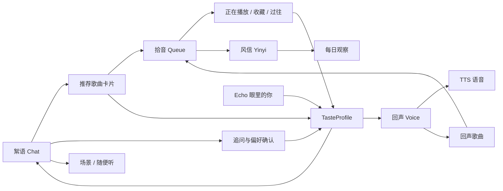
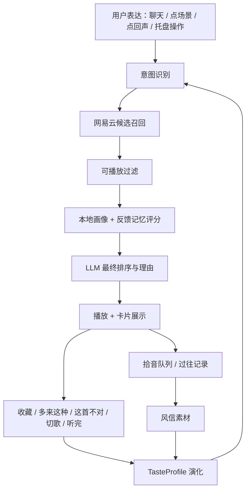
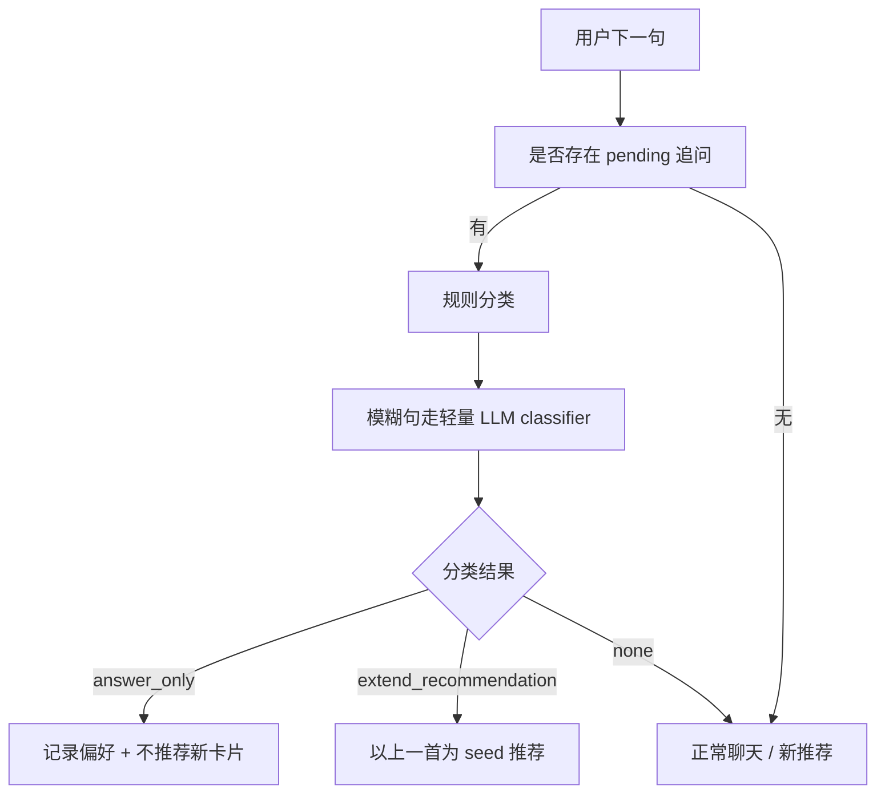

# Echo 产品构思与开发交接文档

> 面向对象：开发总监、后续接手的全栈工程师、产品负责人  
> 当前形态：Windows Electron 桌面应用，React + TypeScript + SQLite + OpenAI 兼容 LLM + 网易云 API  
> 核心入口：`F:\echo\echo-app`

## 1. 产品定位

Echo 是一个有记忆的 AI 音乐陪伴助手。它以聊天为主入口，以真实播放音乐为基础能力，以持续画像、风信、回声、主动关心形成陪伴感。

用户感知里的 Echo 应该像一个熟悉你口味的音乐朋友：

- 能听懂“这个时候听点什么”“来一首激昂的”“这首氛围可以”这类自然表达。
- 能把歌曲推荐、播放、收藏、切歌、反馈都沉淀为记忆。
- 能在每天的风信里回看用户当天的音乐轨迹。
- 能在回声里用一段语音把场景、心情和音乐接起来。
- 能在合适时机主动关心，但保持克制。

产品的第一性目标是“让用户感觉 Echo 更懂我”。所有功能都服务这个目标。

## 2. 当前信息架构

顶部主 tab 已统一为：

- `絮语`：主对话入口。推荐、闲聊、追问、场景随便听都从这里发生。
- `风信`：每日音乐观察日记。由当天对话、播放、推荐、场景、主动关心等素材生成。
- `回声`：Echo 开口说几句。TTS 语音 + 背景音乐 + 连续回声。
- `拾音`：当天推荐/播放列表、收藏、过往记录、自动连播。

辅助入口：

- 点击左上角 Logo：进入 `Echo 眼里的你`，展示 TasteProfile、画像文案、代表曲目、流派、艺人、mood。
- 设置页：LLM、网易云登录、TTS、风信、主动关心、数据清空、关闭行为等。
- 托盘右键菜单：显示 Echo、回声一下、场景快速播放、暂停/继续、退出。



## 3. 核心体验闭环

Echo 的核心闭环是：



每个用户动作都应该尽量留下有用信号：

- 播放完整：增强艺人、风格、场景的置信度。
- 切歌：降低当前方向权重。
- 收藏：长期正向偏好，进入收藏 tab。
- 多来这种：短期强正反馈，影响下一次推荐。
- 这首不对：短期强负反馈，下一次推荐换方向。
- 回答 Echo 追问：写入偏好信号，保护当前上下文。

## 4. 导入歌单与推荐职责

当前产品决策：

- 导入歌单用于建模：识别用户长期口味、安全区、mood、genre、artist、signature tracks。
- 后续推荐候选来自网易云 API。
- 导入歌单里的歌曲可以作为语义种子，但主推荐池应走网易云召回和可播放过滤。

### 4.1 歌单建模

导入歌单后：

1. 保存原始结构化数据。
2. 生成 `track_semantics`：语言、曲风、mood、scene、energy、tempo、safe/explore、confidence。
3. 聚合到 TasteProfile：流派、艺人、mood、代表曲目、探索倾向。
4. 生成 `Echo 眼里的你` 的画像文案和可追问问题。

语义标签可以批量调用 LLM。建议按 20-30 首一批，结果缓存到本地，重复导入只补新增歌曲。

### 4.2 推荐链路

主推荐链路位于 `src/main/services/recommendation.ts` 和 `src/main/services/chat.ts`。

关键步骤：

1. 先判断这句是否与音乐相关。
2. 用规则 + LLM 解析结构化意图：
   - mood
   - scene
   - language
   - energy
   - tempo
   - targetCount
   - seedTitle
   - artistQuery
   - rejectIf
3. 召回网易云候选：
   - 每日推荐 `recommend_songs`
   - 个人 FM `personal_fm`
   - 相似歌曲 `simi_song`
   - 曲风 `style_song`
   - 搜索 `cloudsearch`
   - 新歌 `personalized_newsong`
   - 艺人 top songs
   - 歌单搜索
4. 用 `song_url_v1` 或等价播放链接能力过滤可播放歌曲。
5. 应用冷却策略，降低近期重复歌曲。
6. 应用用户反馈记忆和语义相似度评分。
7. 交给 LLM 做最终 1-5 首排序和差异化理由。
8. 写入推荐队列、对话卡片、播放状态。

默认推荐 1 首。用户明确说几首就给几首，上限 5 首。超过 5 首时固定话术：`歌不在多，慢慢听。我先给你挑 5 首。`

## 5. 对话追问机制

Echo 会在合适时机顺口追问，用来澄清它对用户口味的理解。

当前追问要求：

- 一天最多问 3 次。
- 连续两轮绝对不问。
- 追问来自动态问题池：当前推荐、行为矛盾、收藏/跳歌、画像不确定点。

### 5.1 用户回复追问的分类

用户下一句会先走 `followupAnswerClassifier`，结果分三类：

- `answer_only`：用户回答追问，例如“我觉得这首歌的氛围可以”。只回应确认，记录记忆，不换歌。
- `extend_recommendation`：用户明确延展，例如“这种再来一首”。以上一首歌为 seed 去推荐。
- `none`：新音乐请求或普通闲聊，交给主对话链路。

这层对产品体验很关键。它保护“Echo 正在理解我”的连续性，避免用户回答追问后被突然换歌。



## 6. 播放与拾音逻辑

播放状态是全局的，来源通过 `sourceContext` 标记：

- `chat`：絮语推荐
- `voice`：回声
- `scene`：场景
- `queue`：拾音列表
- `favorite`：收藏
- `history`：过往
- `care`：主动关心

### 6.1 拾音页的设计语义

拾音页承载“今天 Echo 给我接过什么歌”：

- 当天在絮语推荐过的歌应进入 `正在播放` 列表。
- 回声推荐的歌也应进入当天列表。
- 场景一次性推荐 5 首，应该进入当天列表并支持自动连播。
- 今天过去后进入 `过往`。
- 过往歌曲可以播放、收藏。
- 过往清空只影响列表展示，不影响标签、画像、风信素材。

### 6.2 自动连播

自动连播是全局播放偏好，拾音列表、絮语推荐、场景队列都应遵守。

回声的“连续回声”是另一种模式：

- 它控制每段回声结束后是否再生成下一段回声。
- 当前播放被非回声来源接管时，回声 UI 复位，连续回声关闭。
- 页面切换本身不应该复位回声。

## 7. 回声功能

回声是 Echo 的“电台时刻”：

1. 用户点击 `听 Echo 说几句`。
2. 主进程生成一段 60-100 字场景表达。
3. 调 TTS 生成语音。
4. TTS 播放时，背景音乐低音量接入。
5. TTS 结束后，音乐恢复正常音量。
6. 页面停留在回声完成态，用户可再来一次、开启连续回声、回到絮语。

关键技术点：

- TTS 设置在 settings 中保存。
- 语音失败时保留文字，健康状态记录 degraded/error。
- 背景音乐来自同一条推荐链路，写入拾音和播放历史。
- 回声歌曲的 `sourceContext` 必须是 `voice`。

## 8. 风信功能

风信是 Echo 每天写给自己的观察记录，面向用户展示。

素材来源：

- 当天对话
- 当天推荐歌曲
- 播放完成 / 切歌 / 收藏 / 反馈
- 回声内容
- 场景播放
- 主动关心触发
- TasteProfile 摘要
- 最近几篇风信

调性要求：

- 像朋友，不像报告。
- 可以承认“不知道”“没看清”。
- 2-4 段，短而有观察。
- 使用 `prompts/yinyi-writer-v4.md`。

定时机制：

- 到设置时间生成。
- 启动补偿只补最近一篇缺失风信。
- 失败写入 failed 状态，页面支持手动重生成。
- 日期使用本地时间，避免 00:00-07:59 落到前一天。

## 9. Echo 眼里的你

主页是 Echo 的长期理解展示，核心是 TasteProfile。

展示内容：

- `echo_portrait`：Echo 对用户的 100-120 字画像。
- `signature_tracks`：7 首代表曲目。
- `genres`：流派权重和趋势。
- `artists`：艺人亲近度。
- `moods`：语义标签聚合后的心情倾向。

刷新机制建议保持两段式：

- 17:00：结构刷新，处理播放、收藏、反馈、标签等结构信号。
- 17:30：文案刷新，用最新结构信号重写画像文案。

实现注意：

- 启动刷新不能提前消费 17:00 固定刷新。
- skipped 不能作为当天最终状态，后续信号足够时仍可刷新。
- 画像文案刷新失败要记录 failed，不能写 completed。
- 主页顶部“写于”日期应与底部画像更新时间同步。

## 10. 主动关心 Care Pings

主动关心让 Echo 具备桌面陪伴感。

频率设计：

- gentle：每天 2 次
- normal：每天 3 次
- frequent：每天 4 次

时间设计：

- 每天在固定时间段内随机一个触发时间。
- 不在 UI 展示详细计划，保持主动性。
- 触发后可显示系统通知。
- 点击通知应唤起 App，并进入对应页面或播放推荐歌曲。

通知类型：

- `recommend_track`：主动推荐一首歌。
- `casual_check`：轻问候。
- `voice_invite`：邀请听回声。

边界：

- Windows 通知样式由系统控制，产品只能控制标题、正文、图标、点击行为。
- 免打扰模式会屏蔽通知。
- App 关闭期间的主动关心无需批量补发。
- 主动推荐歌曲也应走网易云推荐链路，写入记忆和拾音。

## 11. 设置与安全

敏感信息：

- LLM API key
- 网易云 cookie

要求：

- 主进程使用 Electron `safeStorage` 加密。
- 禁止明文降级。
- 旧版 `plain:` 数据无法升级时应清空并提示重填。
- Cookie 不通过 IPC 传给渲染进程。

设置页 UX 原则：

- 已保存的模型配置显示“已保存”，测试连接作为主动动作。
- 无效设置给轻提示。
- 全屏不打扰等未实现功能应移除 UI。
- 关闭行为采用产品风格弹窗：最小化到托盘 / 直接退出 / 下次按这个选择处理。

## 12. 关键工程结构

```text
echo-app/
├─ electron/
│  ├─ main.ts              # Electron 入口、窗口、托盘、调度启动
│  └─ preload.ts           # window.echo API 暴露
├─ src/
│  ├─ App.tsx              # 全局页面、播放器、设置、导航状态
│  ├─ types/ipc.ts         # 主进程与渲染进程共享类型
│  ├─ main/
│  │  ├─ ipc.ts            # IPC 注册
│  │  ├─ db/               # SQLite 表与读写
│  │  ├─ llm/              # OpenAI 兼容 LLM 客户端与 prompt 组装
│  │  ├─ netease/          # 网易云登录、搜索、播放链接
│  │  ├─ services/
│  │  │  ├─ chat.ts        # 絮语主链路
│  │  │  ├─ recommendation.ts
│  │  │  ├─ playback.ts
│  │  │  ├─ queue.ts
│  │  │  ├─ listening.ts   # 回声生成
│  │  │  ├─ yinyi.ts
│  │  │  ├─ taste.ts
│  │  │  ├─ tasteQuestionScheduler.ts
│  │  │  ├─ carePings.ts
│  │  │  ├─ scene.ts
│  │  │  └─ scheduler.ts
│  └─ renderer/
│     ├─ pages/
│     │  ├─ Chat.tsx
│     │  ├─ Yinyi.tsx
│     │  ├─ Voice.tsx
│     │  ├─ Queue.tsx
│     │  ├─ EchoProfile.tsx
│     │  └─ Settings.tsx
│     └─ components/
├─ prompts/
├─ design/
├─ specs/
└─ tasks/
```

## 13. 后续开发总监重点检查点

优先看这些链路：

1. `chat.ts` 与 `tasteQuestionScheduler.ts`：追问回答、推荐短路、延展推荐的边界。
2. `recommendation.ts`：意图解析、冷却、可播放过滤、反馈记忆评分。
3. `queue.ts` 与 `playback.ts`：不同来源歌曲进入拾音、过往、自动连播的统一性。
4. `listening.ts` 与 `Voice.tsx`：回声歌曲 sourceContext、连续回声、TTS 失败兜底。
5. `scheduler.ts`、`carePings.ts`、`taste.ts`、`yinyi.ts`：定时任务、补偿、失败记录、日期本地化。
6. `secureStorage.ts`、`netease/auth.ts`、`settings`：敏感信息加密和旧数据迁移。

## 14. 产品判断准则

后续开发遇到空白决策时，按下面顺序判断：

1. 是否让 Echo 更像一个懂你的朋友。
2. 是否让推荐结果更符合当前语境。
3. 是否把用户动作沉淀成可用记忆。
4. 是否避免突然打断当前播放和对话上下文。
5. 是否让用户少理解机制，多感受到结果。

Echo 的产品质感来自细节一致性：文案、状态、播放、记忆、队列、时间、通知都要围绕同一套上下文运转。
